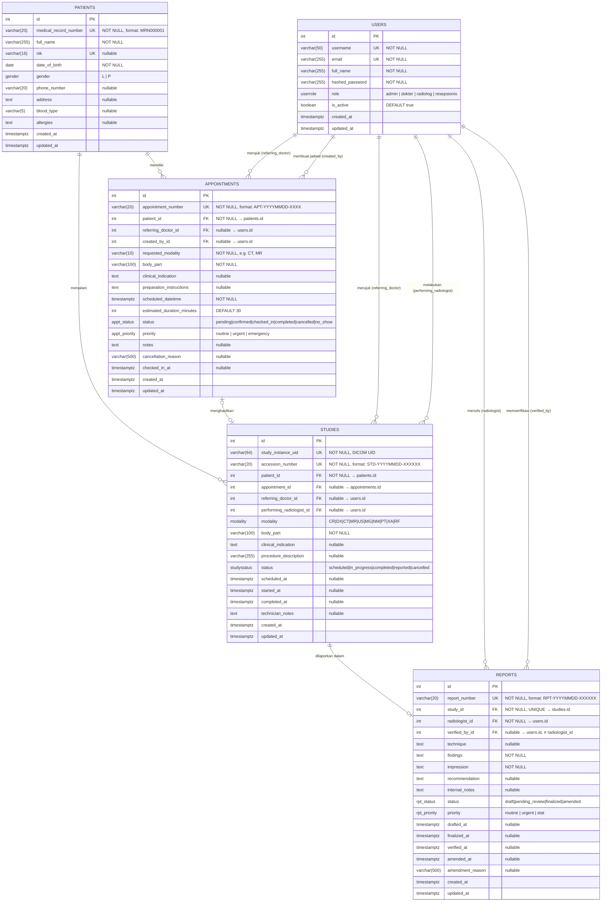

# ERD — UT-RIS Radiology Information System

## Entity Relationship Diagram



---

## Penjelasan Relasi

### Kardinalitas

| Relasi | Tipe | Keterangan |
|--------|------|------------|
| `patients` → `appointments` | 1 : N | Satu pasien bisa punya banyak jadwal |
| `patients` → `studies` | 1 : N | Satu pasien bisa menjalani banyak pemeriksaan |
| `appointments` → `studies` | 1 : 0..1 | Satu jadwal menghasilkan maks. satu pemeriksaan |
| `studies` → `reports` | 1 : 0..1 | Satu pemeriksaan menghasilkan tepat satu laporan |
| `users` → `appointments` (referring) | 1 : N | Satu dokter bisa merujuk banyak jadwal |
| `users` → `appointments` (created_by) | 1 : N | Satu resepsionis bisa membuat banyak jadwal |
| `users` → `studies` (referring) | 1 : N | Satu dokter bisa merujuk banyak pemeriksaan |
| `users` → `studies` (performing) | 1 : N | Satu radiolog bisa melakukan banyak pemeriksaan |
| `users` → `reports` (author) | 1 : N | Satu radiolog bisa menulis banyak laporan |
| `users` → `reports` (verifier) | 1 : N | Satu radiolog senior bisa verifikasi banyak laporan |

### Catatan Penting

- **`USERS` memiliki 6 FK dari tabel lain** — karena satu user bisa berperan sebagai dokter, radiolog, atau resepsionis tergantung konteks.
- **`appointments.id` → `studies.appointment_id`** bersifat nullable — study bisa dibuat tanpa appointment (walk-in).
- **`reports.study_id`** memiliki constraint `UNIQUE` — menjamin relasi 1-to-1 antara study dan report.
- **`reports.verified_by_id ≠ reports.radiologist_id`** — CHECK constraint mencegah radiolog memverifikasi laporannya sendiri.
- **`ON DELETE RESTRICT`** pada FK kritis (patient→study, study→report) mencegah penghapusan data yang masih direferensikan.
- **`ON DELETE SET NULL`** pada FK opsional (user references) — data tetap ada meski user dihapus.

---

## Alur Kerja Utama

```
Resepsionis          Dokter              Radiolog
     │                  │                   │
     │  Daftarkan Pasien│                   │
     │──────────────────┼───────────────────┤
     │                  │                   │
     │  Buat Appointment│                   │
     │◄─────────────────│                   │
     │                  │                   │
     ▼                  │                   │
APPOINTMENT             │                   │
(status: pending)       │                   │
     │                  │                   │
     │ Konfirmasi        │                   │
     ▼                  │                   │
APPOINTMENT             │                   │
(status: confirmed)     │                   │
     │                  │                   │
     │ Pasien hadir      │                   │
     ▼                  │                   │
APPOINTMENT             │                   │
(status: checked_in)    │                   │
     │                  │                   │
     │ Buat Study        │                   │
     └──────────────────┼──────────────────►│
                        │                   │
                        │              STUDY │
                        │    (status: scheduled)
                        │                   │
                        │         Mulai pemeriksaan
                        │                   ▼
                        │              STUDY
                        │    (status: in_progress)
                        │                   │
                        │         Selesai pemeriksaan
                        │                   ▼
                        │              STUDY
                        │    (status: completed)
                        │                   │
                        │         Tulis laporan
                        │                   ▼
                        │              REPORT
                        │           (status: draft)
                        │                   │
                        │         Finalisasi laporan
                        │                   ▼
                        │              REPORT
                        │        (status: finalized)
                        │                   │
                        │              STUDY
                        │◄──────────────────┤
                        │    (status: reported)
                        │
                   Baca laporan
```

---

## Enum Values

| Enum | Values |
|------|--------|
| `userrole` | `admin`, `dokter`, `radiolog`, `resepsionis` |
| `gender` | `L`, `P` |
| `modality` | `CR`, `DX`, `CT`, `MR`, `US`, `MG`, `NM`, `PT`, `XA`, `RF` |
| `studystatus` | `scheduled`, `in_progress`, `completed`, `reported`, `cancelled` |
| `reportstatus` | `draft`, `pending_review`, `finalized`, `amended` |
| `reportpriority` | `routine`, `urgent`, `stat` |
| `appointmentstatus` | `pending`, `confirmed`, `checked_in`, `completed`, `cancelled`, `no_show` |
| `appointmentpriority` | `routine`, `urgent`, `emergency` |
