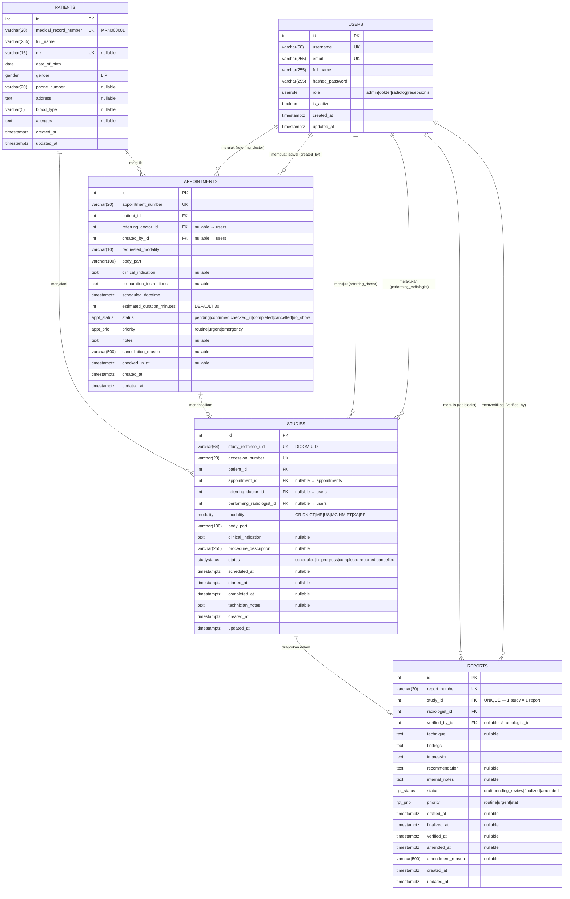

# 02 — ERD & Database Schema

## Entity Relationship Diagram



---

## Tabel Relasi

| Dari | Ke | Kardinalitas | Keterangan |
|------|----|:---:|------------|
| `patients` | `appointments` | 1 : N | Satu pasien bisa punya banyak jadwal |
| `patients` | `studies` | 1 : N | Satu pasien bisa menjalani banyak pemeriksaan |
| `appointments` | `studies` | 1 : 0..1 | Satu jadwal → maks. 1 pemeriksaan (nullable) |
| `studies` | `reports` | 1 : 0..1 | Satu pemeriksaan → tepat 1 laporan (UNIQUE FK) |
| `users` | `appointments` | 1 : N | Sebagai `referring_doctor` |
| `users` | `appointments` | 1 : N | Sebagai `created_by` (resepsionis) |
| `users` | `studies` | 1 : N | Sebagai `referring_doctor` |
| `users` | `studies` | 1 : N | Sebagai `performing_radiologist` |
| `users` | `reports` | 1 : N | Sebagai `radiologist` (penulis) |
| `users` | `reports` | 1 : N | Sebagai `verified_by` (verifikator) |

---

## Enum Types PostgreSQL

```sql
-- Peran pengguna
CREATE TYPE userrole AS ENUM ('admin', 'dokter', 'radiolog', 'resepsionis');

-- Jenis kelamin
CREATE TYPE gender AS ENUM ('L', 'P');

-- Modalitas alat radiologi (standar DICOM)
CREATE TYPE modality AS ENUM (
    'CR',  -- Computed Radiography
    'DX',  -- Digital X-Ray
    'CT',  -- Computed Tomography
    'MR',  -- Magnetic Resonance Imaging
    'US',  -- Ultrasonography
    'MG',  -- Mammography
    'NM',  -- Nuclear Medicine
    'PT',  -- PET Scan
    'XA',  -- X-Ray Angiography
    'RF'   -- Radiofluoroscopy
);

-- Status pemeriksaan
CREATE TYPE studystatus AS ENUM (
    'scheduled', 'in_progress', 'completed', 'reported', 'cancelled'
);

-- Status laporan
CREATE TYPE reportstatus AS ENUM (
    'draft', 'pending_review', 'finalized', 'amended'
);

-- Prioritas laporan
CREATE TYPE reportpriority AS ENUM ('routine', 'urgent', 'stat');

-- Status jadwal
CREATE TYPE appointmentstatus AS ENUM (
    'pending', 'confirmed', 'checked_in', 'completed', 'cancelled', 'no_show'
);

-- Prioritas jadwal
CREATE TYPE appointmentpriority AS ENUM ('routine', 'urgent', 'emergency');
```

---

## Constraint Penting

### 1. Satu Study = Satu Report (UNIQUE FK)
```sql
-- Di tabel reports:
study_id INTEGER NOT NULL UNIQUE REFERENCES studies(id) ON DELETE RESTRICT
```
Constraint ini menjamin tidak ada dua laporan untuk satu pemeriksaan yang sama.

### 2. Verifikator ≠ Penulis Laporan (CHECK)
```sql
CONSTRAINT chk_reports_verifier
    CHECK (verified_by_id IS NULL OR verified_by_id != radiologist_id)
```
Radiolog tidak boleh memverifikasi laporannya sendiri — memerlukan second opinion.

### 3. ON DELETE RESTRICT vs SET NULL
```sql
-- Data kritis: tidak boleh dihapus jika masih direferensikan
patient_id  REFERENCES patients(id)  ON DELETE RESTRICT
study_id    REFERENCES studies(id)   ON DELETE RESTRICT

-- Data opsional: set NULL jika user dihapus (data tetap ada)
referring_doctor_id  REFERENCES users(id)  ON DELETE SET NULL
created_by_id        REFERENCES users(id)  ON DELETE SET NULL
```

---

## Indexes

```sql
-- users
CREATE INDEX ix_users_username ON users (username);
CREATE INDEX ix_users_email    ON users (email);

-- patients
CREATE INDEX ix_patients_mrn       ON patients (medical_record_number);
CREATE INDEX ix_patients_full_name ON patients (full_name);

-- appointments (composite untuk query umum)
CREATE INDEX ix_appointments_patient_status  ON appointments (patient_id, status);
CREATE INDEX ix_appointments_scheduled       ON appointments (scheduled_datetime);

-- studies (composite untuk query umum)
CREATE INDEX ix_studies_patient_status  ON studies (patient_id, status);
CREATE INDEX ix_studies_modality_status ON studies (modality, status);
CREATE INDEX ix_studies_scheduled_at    ON studies (scheduled_at);

-- reports (composite untuk query umum)
CREATE INDEX ix_reports_radiologist_status ON reports (radiologist_id, status);
CREATE INDEX ix_reports_status_priority    ON reports (status, priority);
CREATE INDEX ix_reports_finalized_at       ON reports (finalized_at);
```

---

## SQLAlchemy Models — Potongan Kode

### TimestampMixin (base_model.py)
```python
class TimestampMixin:
    """Mixin yang menambahkan created_at dan updated_at ke semua model."""

    created_at: Mapped[datetime] = mapped_column(
        DateTime(timezone=True),
        server_default=func.now(),
        nullable=False,
    )
    updated_at: Mapped[datetime] = mapped_column(
        DateTime(timezone=True),
        server_default=func.now(),
        onupdate=func.now(),
        nullable=False,
    )
```

### User Model
```python
class User(TimestampMixin, Base):
    __tablename__ = "users"

    id: Mapped[int] = mapped_column(Integer, primary_key=True, index=True)
    username: Mapped[str] = mapped_column(String(50), unique=True, nullable=False)
    email: Mapped[str] = mapped_column(String(255), unique=True, nullable=False)
    full_name: Mapped[str] = mapped_column(String(255), nullable=False)
    hashed_password: Mapped[str] = mapped_column(String(255), nullable=False)
    role: Mapped[UserRole] = mapped_column(Enum(UserRole, name="userrole"), nullable=False)
    is_active: Mapped[bool] = mapped_column(Boolean, default=True, nullable=False)

    # Relasi ke Study (sebagai dokter pengirim)
    referred_studies: Mapped[List["Study"]] = relationship(
        "Study", foreign_keys="Study.referring_doctor_id",
        back_populates="referring_doctor",
    )
    # Relasi ke Study (sebagai radiolog pelaksana)
    performed_studies: Mapped[List["Study"]] = relationship(
        "Study", foreign_keys="Study.performing_radiologist_id",
        back_populates="performing_radiologist",
    )
```

### Study Model (relasi kompleks)
```python
class Study(TimestampMixin, Base):
    __tablename__ = "studies"

    # Dua FK ke tabel users dengan peran berbeda
    referring_doctor_id: Mapped[Optional[int]] = mapped_column(
        Integer, ForeignKey("users.id", ondelete="SET NULL"), nullable=True
    )
    performing_radiologist_id: Mapped[Optional[int]] = mapped_column(
        Integer, ForeignKey("users.id", ondelete="SET NULL"), nullable=True
    )

    # Composite indexes untuk query performa tinggi
    __table_args__ = (
        Index("ix_studies_patient_status", "patient_id", "status"),
        Index("ix_studies_modality_status", "modality", "status"),
    )
```
